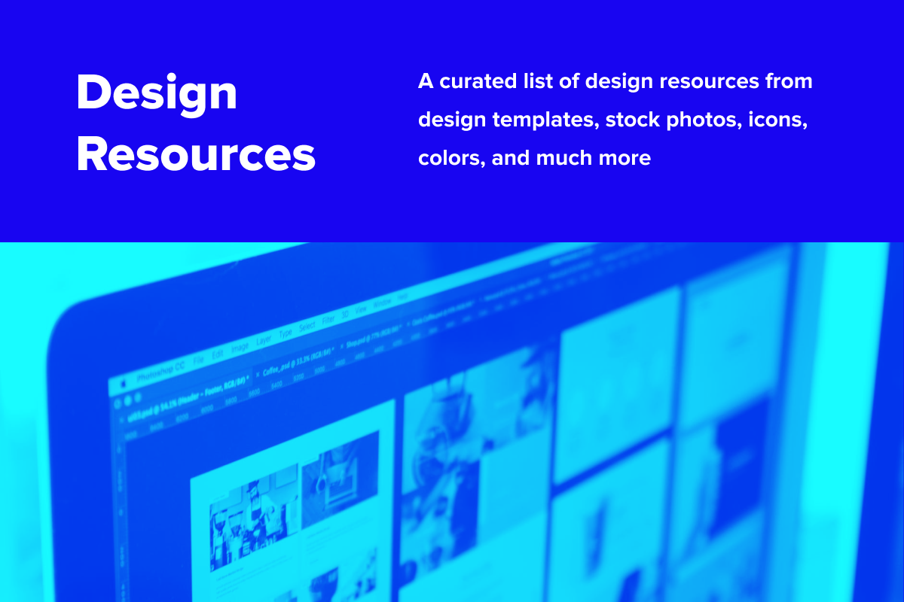

# Design Resources

A curated list of design resources from design templates, stock photos, icons, colors, and much more

## Table of Contents

- [General](#general)
- [Colors](#colors)
- [Illustrations](#illustrations)
- [Stock Photos](#stock-photos)
- [Icons](#icons)

### General

Website | Description
--------|------------
[Freebiesbug](https://freebiesbug.com/) | Hand-picked resources for web designer and developers, constantly updated.
[Sketch App Sources](https://www.sketchappsources.com/) | Icons, UI Kits, Wireframes, iOS, Android Templates for Sketch
[Figma Community](https://www.figma.com/community) | Explore, install, use, and remix thousands of files and plugins
[Uplabs](https://www.uplabs.com/) | Unlimited UI Kits, Icons, Templates, Themes and More (free & premium )
[GrapicBurger](https://graphicburger.com/) | Tasty design resources made with care for each pixel. Free for both personal & commercial use
[InvisionApp](https://www.invisionapp.com/inside-design/design-resources/) | Browse our library of free, high-quality UI kits, icon packs, and mockups
[Freebiesketch](https://freebiesketch.com/) | The best collection of free resources for UX / UI Designer
[100 Daily UI](https://100dailyui.webflow.io/) | Free Figma library of products, elements, and screens
[Figma Resources](https://www.figmabox.com/) | A curated Figma resources, UI kits, templates & freebies to save you time and speed up your workflow
[UI Space](https://uispace.net/) | Free PSD, AI, Fonts and more
[CodeMyUI](https://codemyui.com) | Handpicked collection of web design & UI inspiration with code snippets.
[Hero Patterns](https://www.heropatterns.com/) | A collection of repeatable SVG background patterns for you to use on your web projects.

    <b><a href="#table-of-contents">↥ Back To Top</a></b>

### Colors

Website | Description
--------|------------
[Adobe Color](https://color.adobe.com/) | A color palette generator
[Coolors](https://coolors.co/) | Generate or browse beautiful color combinations for your designs
[Colormind](http://colormind.io/) | Colormind is a color scheme generator that uses deep learning. It can learn color styles from photographs, movies, and popular art.
[Color Hunt](https://colorhunt.co/) | a free and open platform for color inspiration with thousands of trendy hand-picked color palettes
[Google Material Color Tool](https://material.io/resources/color/) | Create and share color palettes for your UI, and measure the accessibility of any color combination.
[ColorSpace](https://mycolor.space/) | Generate nice color palettes from one color

    <b><a href="#table-of-contents">↥ Back To Top</a></b>

### Illustrations

Website | Description
--------|------------
[unDraw](https://undraw.co/illustrations) | Open-source illustrations for any idea you can imagine and create.
[DrawKit](https://www.drawkit.io/) | Hand-drawn vector illustration and icon resources, perfect for your next project.
[Blush](https://blush.design/) | Free customizable illustrations with Figma Plugin
[404 illustrations](https://error404.fun/) | Free illustrations for 404 pages
[Open Peeps](https://www.openpeeps.com/) | Hand drawn illustration library
[Absurd Design](https://absurd.design/) | Free surrealist illustrations and vector art
[Manypixels](https://www.manypixels.co/gallery) | 2,500+ royalty-free and editable illustrations to power up your design projects
[Avataaars](https://avataaars.com) | Avatar Illustrations Sketch Library
[Freellustrations](https://freellustrations.com/) | Collection of high-resolution vector or illustrations background images for modern websites and landing pages

    <b><a href="#table-of-contents">↥ Back To Top</a></b>

### Stock Photos

Website | Description
--------|------------
[Unsplash](https://unsplash.com/) | Beautiful, free images and photos that you can download and use for any project
[Pexels](https://www.pexels.com/) | Download and use the best free stock photos and videos.
[Stock Snap](https://stocksnap.io/) | The #1 source for beautiful free photos. High quality and high resolution stock images free from all copyright restrictions (CC0)
[Pixabay](https://pixabay.com/) | More than 2.2 million Stunning Free Images and video to Use Anywhere
[Burst](https://burst.shopify.com/) | Free stock photos for websites and commercial use
[PicJumbo](https://picjumbo.com/) | free stock photos, backgrounds and free high-resolution images for personal and commercial use

    <b><a href="#table-of-contents">↥ Back To Top</a></b>

### Icons

Website | Description
--------|------------
[Feather Icons](https://feathericons.com/) | Simply beautiful open source icons
[Streamline Icons](https://streamlineicons.com/) | Download 30,000 free PNG icons for website, web app, software, web design
[Material Icons](https://fonts.google.com/icons) | Delightful, beautifully crafted symbols for common actions and items
[Font Awesome](https://fontawesome.com) | The world’s most popular and easiest to use icon set
[Remix Icon](https://remixicon.com/) | set of open-source neutral-style system symbols elaborately crafted for designers and developers
[Noun Project](https://thenounproject.com) | Browse over 3 million art-quality icons and photos
[CSS.gg](https://css.gg/) | Open-source CSS, SVG and Figma UI Icons that are available in SVG Sprite, styled-components, NPM & API
[Ikonate](https://ikonate.com/) | fully customisable & accessible vector icons
[Tabler Icons](https://tabler-icons.io) | A set of over 1250 free MIT-licensed high-quality SVG icons for you to use in your web projects.

    <b><a href="#table-of-contents">↥ Back To Top</a></b>

